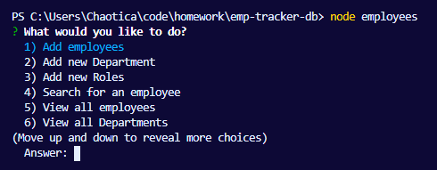
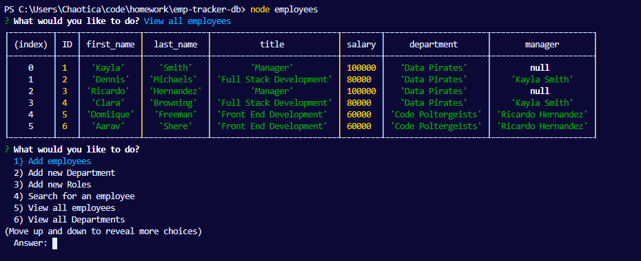

# Employee Tracker Database

## Description
  
A program created to track employees in a database system. Add, update, and view data on employees.

## Table of Contents (Optional)
- [Installation](#installation)
- [Usage](#usage)

## Installation
1) Install node.js 
2) Install Inquirer 
3) Install mysql 

## Usage
Open your terminal (if not already open) and type in 'node employees.js'. You will see a series of prompts. Follow the prompts to add and save data.

[Program Video](https://drive.google.com/file/d/1eNWVVnfQxNxky545q7elY4HYH90VfOTF/view?usp=sharing)

